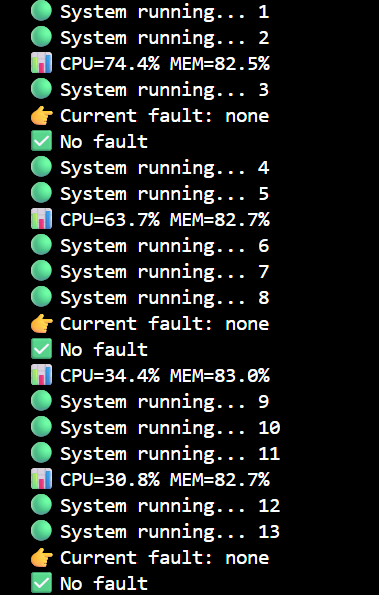
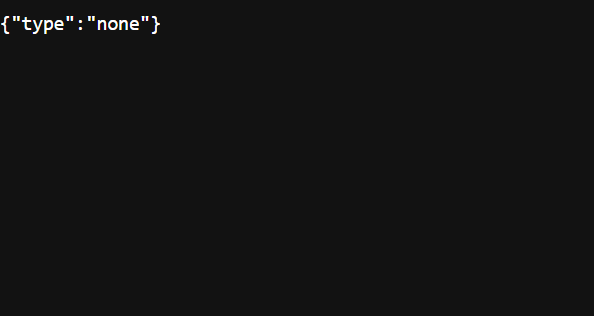
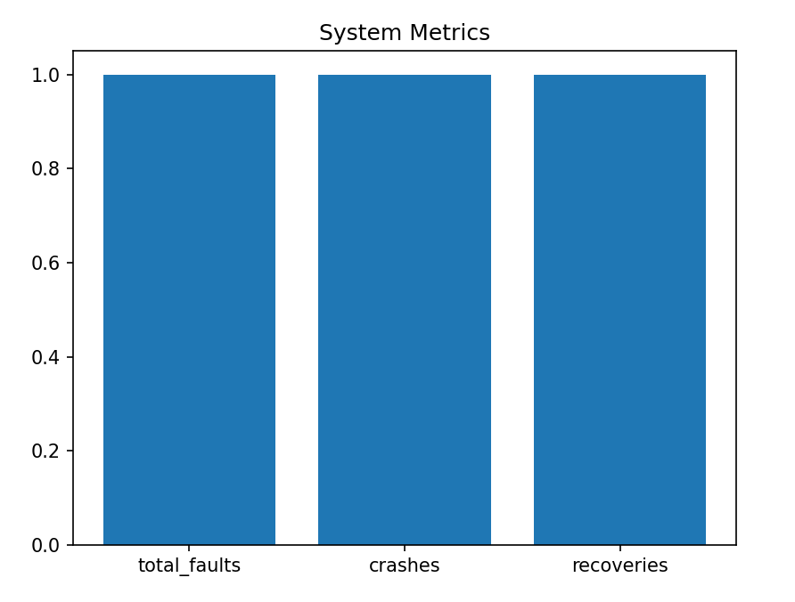

# Fault Injection & Self-Healing System

## 📌 Overview

This project simulates real-world system failures such as crashes, latency, and memory spikes, and demonstrates automatic recovery using a supervisor-based architecture.

## 🚀 Features

* Fault Injection (Crash, Delay, Memory)
* Self-Healing System (Auto Restart)
* REST API for fault control
* Real-time Monitoring (CPU & Memory)
* Live Dashboard Visualization
* Logging & Metrics Tracking

## 🏗️ Architecture

* Target System: Simulates workload
* Fault Injector: Injects failures
* Supervisor: Detects and restarts system
* API: External control using Flask
* Monitor: Tracks system resources
* Dashboard: Visualizes metrics

## ⚙️ Installation

```bash
pip install -r requirements.txt
```

## ▶️ Run

```bash
python main.py
```

## 🌐 API Usage

Check status:

```
http://127.0.0.1:5000/status
```

Inject fault:

```powershell
Invoke-RestMethod -Uri http://127.0.0.1:5000/inject `
-Method POST `
-Headers @{"Content-Type"="application/json"} `
-Body '{"fault":"crash"}'
```

## 📊 Metrics

* total_faults
* crashes
* recoveries

## 🧠 Concepts Used

* Multiprocessing
* Multithreading
* Fault Tolerance
* System Monitoring
* API Design
* Observability

## 🔮 Future Improvements

* Distributed system support
* Kubernetes integration
* Alerting system
* Persistent storage

## 📸 Output Screenshot




