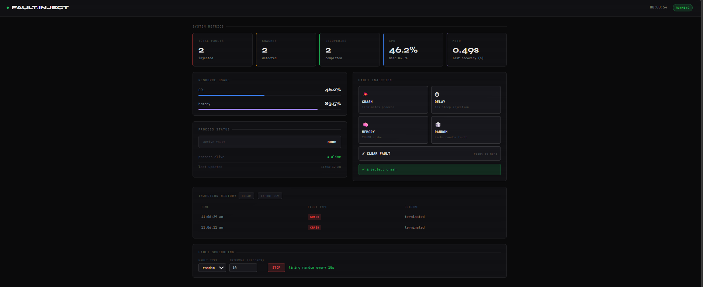

# Fault Injection System

A real-time fault injection and monitoring dashboard built with Python and Flask. Inject faults into a running system process, watch live metrics, track recovery time, and export history — all from a browser UI.

---

## Features

- **Live Metrics** — CPU, memory, crash count, recovery count, and MTTR updated every second
- **Fault Injection** — Manually trigger crash, delay, memory spike, or random faults
- **MTTR Tracking** — Automatically measures Mean Time To Recovery after each crash
- **Fault Scheduling** — Auto-inject faults on a timer (e.g. crash every 30s)
- **Event History** — Log of every injected fault with timestamps and outcomes
- **Export CSV** — Download full fault history as a `.csv` file
- **Process Supervision** — Crashed processes are automatically detected and restarted

---

## Tech Stack

- **Backend** — Python, Flask, Flask-CORS
- **Frontend** — Vanilla HTML/CSS/JS (single file, no framework)
- **Process Management** — `multiprocessing`, `threading`
- **Monitoring** — `psutil`

---

## Project Structure

```
fault_injection_final/
├── main.py              # Entry point — starts all threads and processes
├── api.py               # Flask REST API
├── supervisor.py        # Watches the target process, restarts on crash, tracks MTTR
├── fault_injector.py    # Applies the active fault to the target process
├── monitor.py           # Polls CPU and memory via psutil
├── metrics.py           # Shared metrics state (crashes, recoveries, history)
├── logger.py            # Event logging
├── target_system.py     # The system being monitored/injected
└── static/
    └── index.html       # Dashboard UI
```

---

## Getting Started

### Prerequisites

- Python 3.8+
- pip

### Install dependencies

```bash
pip install flask flask-cors psutil
```

### Run

```bash
python main.py
```

Then open your browser at:

```
http://127.0.0.1:5000
```

---

## API Endpoints

| Method | Endpoint | Description |
|--------|----------|-------------|
| GET | `/` | Dashboard UI |
| GET | `/metrics` | Current CPU, memory, crash/recovery counts |
| POST | `/inject` | Inject a fault `{ "fault": "crash" }` |
| GET | `/history` | Full event history |
| POST | `/clear-history` | Clear event history |
| GET | `/status` | Process status + MTTR data |
| POST | `/schedule` | Start/stop fault scheduler |
| GET | `/schedule/status` | Current scheduler state |

### Fault types

`crash` · `delay` · `memory` · `random` · `none`

---

## Fault Scheduling

Use the scheduling panel on the dashboard to auto-inject faults at a fixed interval.

- Pick a fault type
- Set interval in seconds (minimum 5s)
- Hit **START** — the scheduler fires in the background
- Hit **STOP** to cancel

Useful for demos and stress testing.

---

## MTTR

Mean Time To Recovery is measured automatically. When the supervisor detects a crash, it records the timestamp, restarts the process, then records the recovery timestamp. The difference is shown on the dashboard as **MTTR (last recovery in seconds)**.

---

## Export

Click **export csv** next to the history table to download `fault_history.csv` with columns:

```
timestamp, fault_type, outcome
```

---

## Screenshots



---

## License

MIT